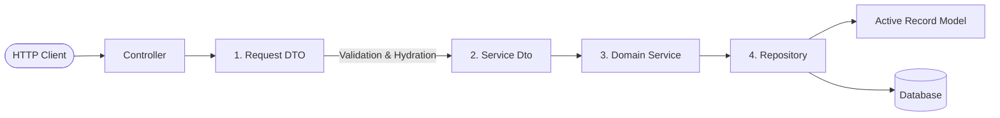

# Yii Clean Architecture (backend)

This skill describes the architecture, constraints, and conventions of the `backend` application. The backend is built using **Yii3** and PHP 8.2+, adhering to Clean Architecture principles to decouple input, domain logic, and persistence.

---

## 1. Core Architecture Pattern

We enforce a strict data flow pipeline for all HTTP API endpoints:


### The Rule of Isolation
1. **Controllers** are thin; they handle routing, authentication, and HTTP request mapping.
2. **Services** contain all business logic, validation, and transaction management. They do not know about HTTP requests or responses.
3. **Repositories** handle database queries and persistence. They do not know about business rules or HTTP.
4. **Active Record Models** are dumb database rows. They do not contain business logic or save themselves.

---

## 2. Pipeline Layers in Detail

### 1. Request DTO (HTTP Input & Validation)
Request DTOs reside in `AdminApi\Controller\<Domain>\Request\<Action>Request.php` and extend `Yiisoft\Input\Http\AbstractInput`.

- **Hydration**: Handled automatically by `yiisoft/input-http` via attributes like `#[FromBody]`, `#[FromQuery]`, or `#[RouteArgument]`.
- **Validation**: Rules are defined via PHP attributes on the properties. Additionally, getters instantiate self-validating **Value Objects** (`Email`, `Uuid`, `NewPassword`, `Text`, etc.).
- **Outcome**: If input is invalid, an `InputValidationException` is thrown before reaching the controller logic, translating automatically to a standard `400 Bad Request` with structured error messages.

**Example Request DTO:**
```php
namespace AdminApi\Controller\Users\Request;

use Yiisoft\Input\Http\AbstractInput;
use Yiisoft\Input\Http\Attribute\Data\FromBody;
use Common\Shared\Http\Rule\Required;
use Common\Shared\Http\Rule\ValueObject;
use Common\Shared\ValueObject\Email;

#[FromBody]
final class CreateRequest extends AbstractInput
{
    public function __construct(
        #[Required]
        #[ValueObject(Email::class)]
        private readonly mixed $email = null,
    ) {}

    public function email(): Email
    {
        return new Email((string)$this->email, field: 'email');
    }
}
```

---

### 2. Service DTO (Domain Boundary Transfer)
To decouple the Controller from the Service layer, data is transferred from Request DTOs into Service-specific DTOs located under `Common\App\Service\<Domain>\Data\<Action>Dto.php`.

- Service DTOs are simple, read-only structures with strong typing.
- They ensure that the Service layer is independent of any HTTP framework.

**Example Service DTO:**
```php
namespace Common\App\Service\User\Data;

use Common\Shared\ValueObject\Email;

final readonly class CreateDto
{
    public function __construct(
        public Email $email,
    ) {}
}
```

---

### 3. Domain Service (Business Logic & Transactions)
Services live under `Common\App\Service\<Domain>\Service.php` and extend `Common\App\Service\AbstractService`.

- **Responsibilities**:
  - Handles business validation (e.g., checking if email is already taken) and throws `ValidationException`.
  - Wraps multi-step database operations in a transaction: `$this->getDb()->beginTransaction()`.
  - Performs the operation and returns either the model or a result object.
  - Catches unexpected failures and delegates logging/mapping to `$this->handleExceptionForApi($e)`.
- **Constraint**: The Service layer is the **only** layer authorized to call Repositories.

**Example Domain Service:**
```php
namespace Common\App\Service\User;

use Common\App\Models\User;
use Common\App\Repository\UserRepository;
use Common\App\Service\AbstractService;
use Common\App\Service\User\Data\CreateDto;
use Common\Shared\Exception\ValidationException;

final readonly class Service extends AbstractService
{
    public function __construct(
        \Psr\Log\LoggerInterface $logger,
        private UserRepository $userRepo,
    ) {
        parent::__construct($logger);
    }

    public function create(CreateDto $dto): User
    {
        if ($this->userRepo->getOneByEmail($dto->email) !== null) {
            throw new ValidationException(
                messageKey: 'user.email_already_exists',
                field: 'email'
            );
        }

        $user = $this->userRepo->getEmptyModel();
        $user->setEmail($dto->email);

        return $this->userRepo->save($user);
    }
}
```

---

### 4. Repository (Data Access & Persistence)
Repositories reside in `Common\App\Repository\<Domain>Repository.php`.

- **Responsibilities**:
  - Owns all SQL queries and entity lookups (e.g. `getOneById`, `getOneByEmail`, `getList`, `count`).
  - Owns **persistence**: the only place where `save()` is called on Active Record entities.
  - Automatically manages ID generation (e.g., assigning a new UUID) and timestamps (`created_at`, `updated_at`) during the save cycle.
  - Resolves models using `$this->model->query()`.

**Example Repository:**
```php
namespace Common\App\Repository;

use Common\App\Models\User;
use Common\Shared\ValueObject\Uuid;
use Common\Shared\ValueObject\Email;
use Common\Shared\Util\Uuid as UuidUtil;
use DateTimeImmutable;

final readonly class UserRepository
{
    public function __construct(
        private User $model,
        private UuidUtil $uuidUtil,
    ) {}

    public function getEmptyModel(): User
    {
        return new User();
    }

    public function save(User $model): User
    {
        if ($model->isNew()) {
            $model->setId($this->uuidUtil->generate());
            $model->setCreatedAt(new DateTimeImmutable());
        }
        $model->setUpdatedAt(new DateTimeImmutable());
        $model->save();
        $model->refresh();

        return $model;
    }

    public function getOneByEmail(Email $email): ?User
    {
        return $this->model->query()
            ->where(['email' => $email->value()])
            ->limit(1)
            ->one();
    }
}
```

---

## 3. Supplementary Documentation

For more detail on other backend components, exceptions, testing, and common pitfalls:
- See [references/anti-patterns.md](file:///D:/develop/git/ext/codegen-app-template/backend/skills/yii-clean-architecture/references/anti-patterns.md) for architectural anti-patterns to avoid.
